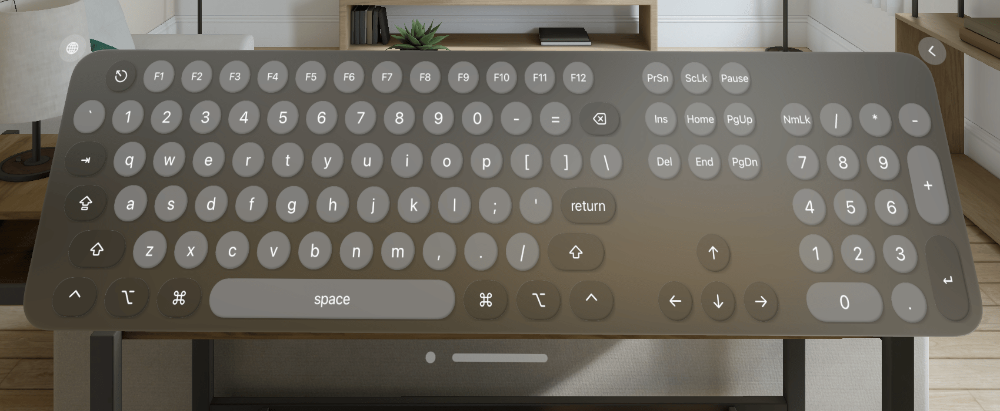

Vision Keyboard Kit
===================


## Features
* Full sized (104-keys) or 60% (no arrow/num keys) mode
* Support for multiple keyboard layouts
* PS/2 Set 1 scan code generation
* Multiple instances with independent event handlers
* Key down and key up events

## Usage
Declare `KeyboardWindowGroup` in your `Scene`:
```swift
import SwiftUI
import VisionKeyboardKit

@main
struct YourApp: App {
    var body: some Scene {
        WindowGroup {
            ContentView()
        }
        KeyboardWindowGroup()
    }
}
```

Open/close the keyboard window using `OpenWindowAction`/`DismissWindowAction` and receive events through `KeyboardEvent.publisher(for:)`:
```swift
import SwiftUI
import VisionKeyboardKit

struct ContentView: View {
    @Environment(\.openWindow) private var openWindow
    @Environment(\.dismissWindow) private var dismissWindow
    @State private var isKeyboardShown: Bool = false

    var body: some View {
        Button {
            if !isKeyboardShown {
                openWindow(keyboardFor: .global)
            } else {
                dismissWindow(keyboardFor: .global)
            }
        } label: {
            Text("Toggle Keyboard")
        }.onReceive(KeyboardEvent.publisher(for: .global)) { event in
            if case .keyboardDidAppear = event {
                isKeyboardShown = true
            } else if case .keyboardDidDisappear = event {
                isKeyboardShown = false
            } else {
                print("Got event: \(event)")
            }
        }
    }
}
```

If you need more than one keyboard with independent event publishers, just pass in any `Hashable` which serves as an identifier for the keyboard.

The returned `Publisher` can be used in the Combine framework for chained processing (such as debounce).
